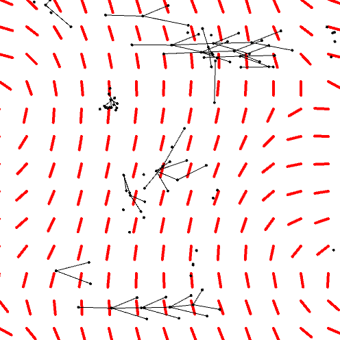

# Windfall
A Fluid Dynamics Simulation based on [Jos Stam's famous method](http://www.dgp.toronto.edu/people/stam/reality/Research/pdf/GDC03.pdf).  
Implementing all kinds of fancy features.  
Includes:  
* Ball joint physics
* Springs (both tension & shear forces)
* LSystems
* Vector fields
* Wrap-around borders 
* lots of colours!

# How to use (controls):
hold the key and click as follows:  
* 's' - smoke
* 'l' - leaf
* 'w' - wind
* 'b' - boundary
* 'p' - pusher  
colors, variables and fields can be controlled from the menu  
* 'm' - to hide/show menu

# Install:
Install [Processing 3](https://processing.org/)  
Clone & open in IDE   
Run!  

## Altenative in command-line (Linux only)
clone & move to repo directory  
Allow execution of `run`:  
```
chmod a+x run
```
run `run`!
```
./run
```

## Screenshots




